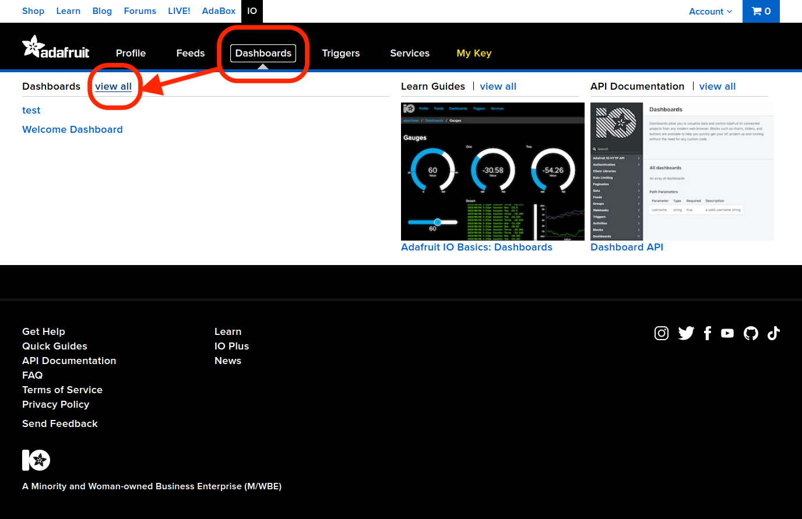
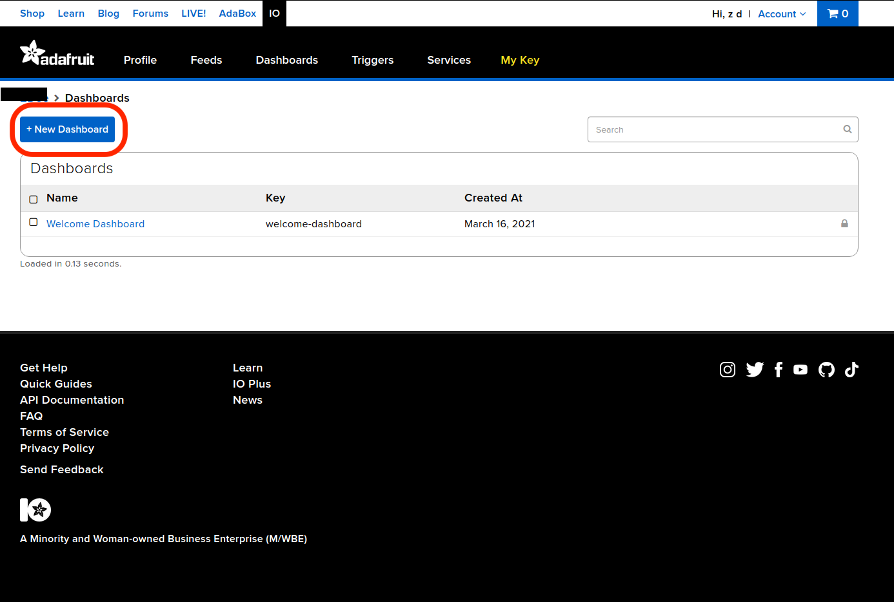

# Real-time monitoring using Raspberry pi

This is file shows how to set up a webcam with Raspberry pi and upload images to Adafruit-IO for real-time monitoring.

## Device

Pi, webcam (connect with USB), PC (I am using a Linux)

## Hardware setup

<mark> Add how to setup Rpi and assembly Rpi camera module here (if necessary).

## Software setup

Video streaming using Adafruit.io. Most information is found in this [article](xxx). Read more about Adafruit Dashboard [here](https://learn.adafruit.com/adafruit-io-basics-dashboards).

### I. Adafruit IO

1. Sign up an account on [Adafruit.io](https://io.adafruit.com/).
2. You might have been redirected to accounts.adafruit.com, now go back to io.adafruit.com/ and login.
3. Go to 'Dashboard' > 'view all'.
   
   Then click '+New Dashboard', enter a name and click on it.
   
4. Click the gear button and select 'create new block'.
   
   We need the image block for video steaming.
   
5. Enter a name for the feed. Select it and go to 'Next step'. On the next page you could put some more details to describe this block. When finished, click 'Create block'.
   >Feed is where data from each sensor is stored, in our case this is where the video from Raspberry Pi camera will be pushed to.
   
6. Now you can go to 'Feeds' to see the feed you just created. This is where you can view your data and change settings.
7. In order to setup software on Raspberry Pi in the next section, go to 'My Key' and you could find the 'Username' and 'Active Key' that you will need later.

### II. Raspberry Pi Setup

1. Install [`fswebcam`](https://www.raspberrypi.org/documentation/usage/webcams/) package on Raspberry Pi:

```bash
sudo apt install fswebcam
```

`fswebcam` is an easy command line package to take pictures using your webcam. The command that we are going to use in our python script is:

```bash
fswebcam -q -r 1280x720 --no-banner --jpeg 60 --save /home/pi/Camera/snapshot.jpg'
```

The `-q` flag makes `fswebcam` to work in quite mode and hides all output messages except for errors. `-r` flag specifies the resolution of the image that we are going to take, here I use 1280*720 as this is the highest resolution supported by my camera. `--no-banner` tells `fswebcam` not to include any text information in the image. `--jpeg 60` specifies the quality of the jpeg images, which is limited by the size of individual data that can be uploaded to Adafruit-IO at each time (100kb). `--save` defines the location and name of snapshot images taken by `fswebcam`. The python script will also be put in that location. These parameters can be adjusted accordingly.

2. Run the [python script](webcam-fswebcam.py) that takes an image every 2 seconds and upload it to Adafruit-IO. You may need to install some of the dependencies with `pip` or `pip3`.

## Archived-Motion method

### Motion configuration

```json
width 1024
height 768
output_pictures off
snapshot_interval 2
snapshot_filename snap
on_picture_save python3 /home/pi/Camera/webcam.py
```
