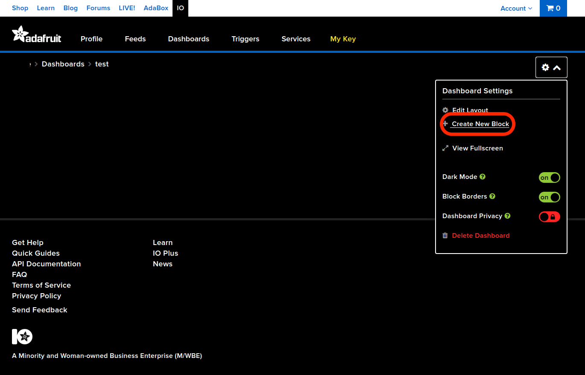
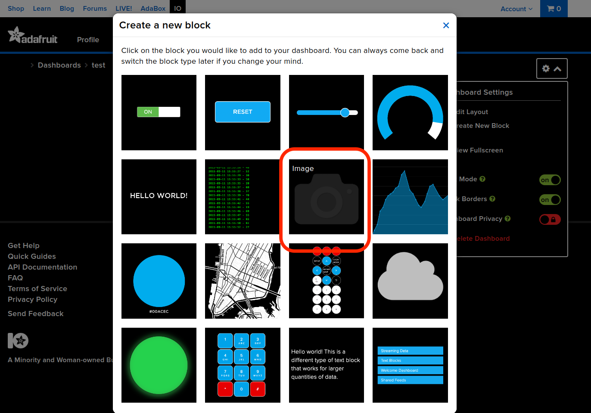
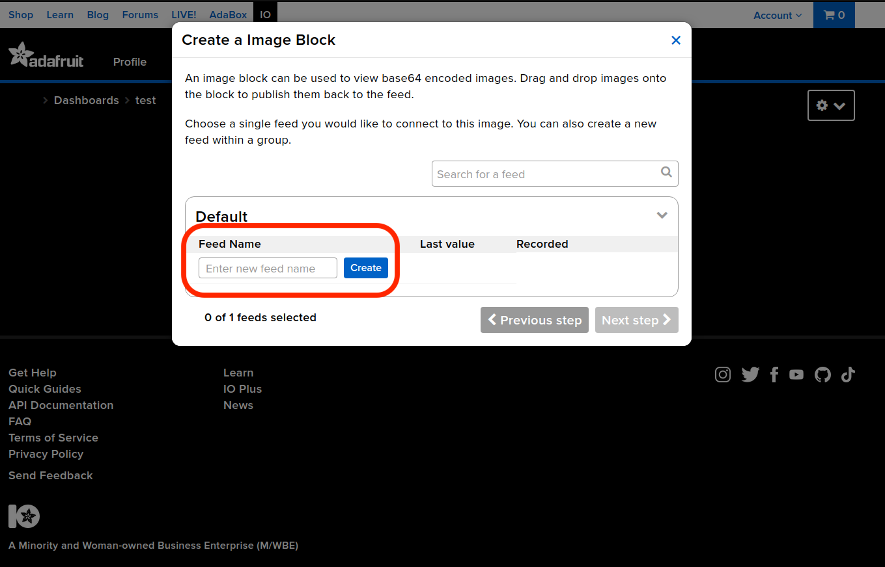

# Real-time monitoring using Raspberry pi

This is a file showing how to set up Raspberry pi camera for real-time monitoring.

## Device

Pi, camera, PC (I am using a Linux)

## Hardware setup

<mark> Add how to setup Rpi and assembly Rpi camera module here (if necessary).

## Software setup

Video streaming using Adafruit.io. Most information is found in this [article](https://iotdesignpro.com/projects/iot-raspberry-pi-cloud-camera-stream-video-from-raspberry-pi-to-cloud), but some details are out of date and some changes were made accordingly. Also refer to this [article](https://learn.adafruit.com/cloud-cam-connected-raspberry-pi-security-camera/adafruit-io). Read more about Adafruit Dashboard [here](https://learn.adafruit.com/adafruit-io-basics-dashboards).

### I. Adafruit IO

1. Sign up an account on [Adafruit.io](https://io.adafruit.com/).
2. You might have been redirected to accounts.adafruit.com, now go back to io.adafruit.com/ and login.
3. Go to 'Dashboard' > 'view all'.
   
   Then click '+New Dashboard', enter a name and click on it.
   
4. Click the gear button and select 'create new block'.
   
   We need the image block for video steaming.
   
5. Enter a name for the feed. Select it and go to 'Next step'. On the next page you could put some more details to describe this block. When finished, click 'Create block'.
   >Feed is where data from each sensor is stored, in our case this is where the video from Raspberry Pi camera will be pushed to.
   
6. Now you can go to 'Feeds' to see the feed you just created. This is where you can view your data and change settings.
7. In order to setup software on Raspberry Pi in the next section, go to 'My Key' and you could find the 'Username' and 'Active Key' that you will need later.

### II. Raspberry Pi Setup

1. Install Node.js on Raspberry Pi.

```bash
curl -sL https://deb.nodesource.com/setup_10.x | sudo bash 
sudo apt install nodejs
```

2. Check if Node.js is installed successfully by checking their versions:

```bash
node –v
npm –v
```

On my computer they were:

```bash
v10.24.0
6.14.11
```

3. Install ‘adafruit-io-camera’ on Raspberry Pi to monitor Pi camera and send pictures to an Adafruit IO feed. This may take some time.

```bash
sudo apt-get update
sudo apt-get install -y imagemagick
sudo npm install --global --no-optional forever forever-service adafruit-io-camera
```

1. After adafruit-io-camera is installed, use your ‘Username’ and ‘AIO Key’ to configure your Adafruit IO account on Raspberry Pi. Replace your username and AIO key on the place of ‘YOUR-USERNAME’ and ‘AIO-KEY’ respectively, which can be found under 'My Key' on io.adafruit.

```bash
adafruit-io camera config --username YOUR-USERNAME --key AIO-KEY
```

5. Now start your camera using the following command, replace ‘pi-camera’ with the name of feed that you just created.

```bash
adafruit-io camera start -f pi-camera -r 2
```

 The '-r' flag specifies timelapse capture rates in seconds, i.e. it is writing a new image to the feed every 2 seconds here. This is limited by the 30 data points per minute provided by the free IO account. If you upgrade your IO account then it will be able to accept 60 data points per minute, therefore you would be able to change -r to 1.

When not in use you can stop pushing video to Adafruit IO by:

```bash
adafruit-io camera stop
```

Next time when you want to start camera again, simply do

```bash
adafruit-io camera start
```