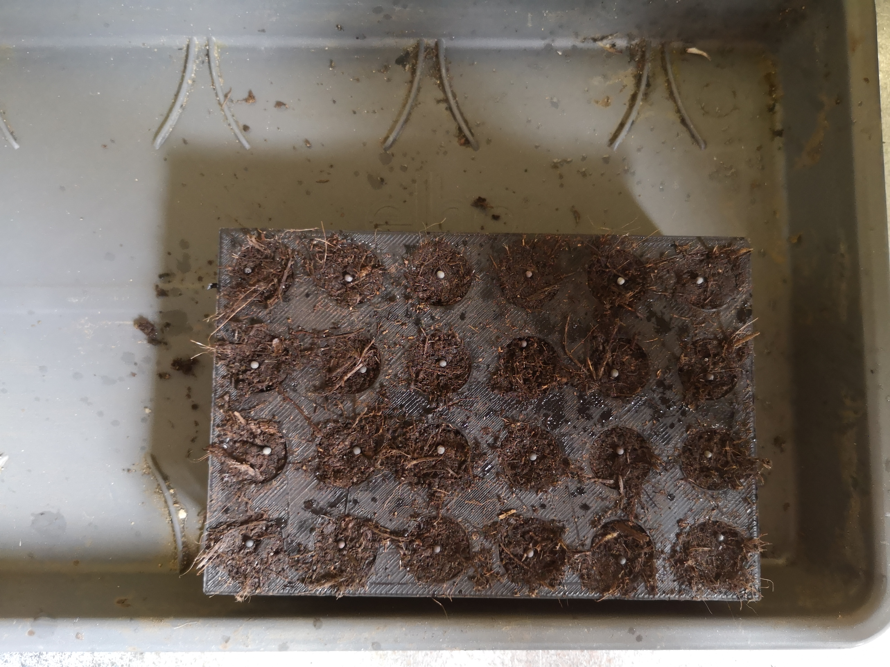
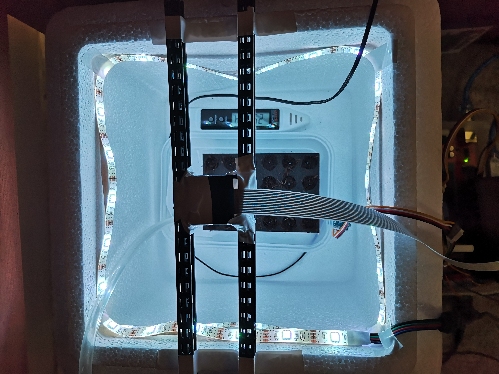
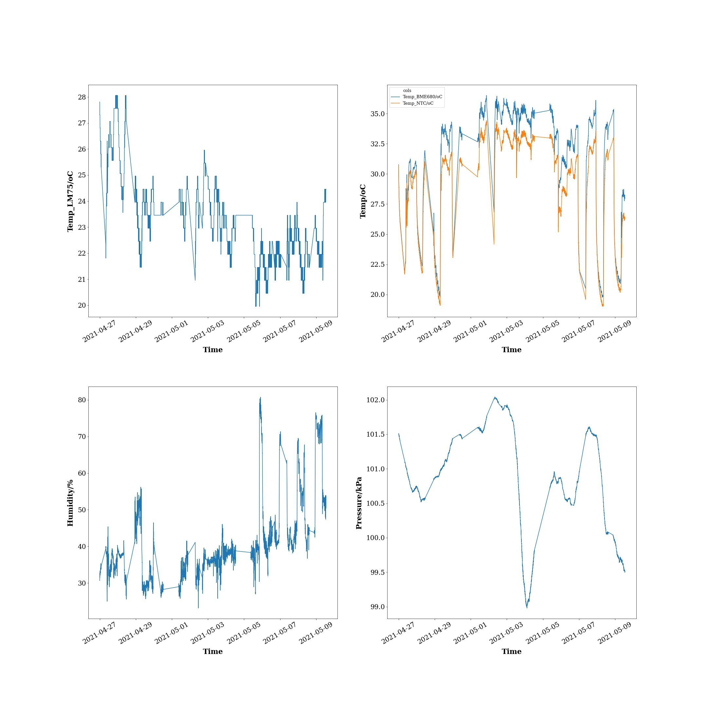

Trials/27.4# Trials

## 1st trial: 27.4.21-10.5.21

### Summary

This is our first trial aiming to test some basic features before moving forward, starting from 11am 27.4.21 and lasted for 14 days. This is the first version of box and 24-well plate, with no environment controls and low brightness light. 1 Pai choi seed was sown per well.

#### Features

1. Temperature, humidity, pressure data were pushed to Adafruit-IO every 30s for real-time monitoring and saved to Google drive for long-term storage.
2. Low-resolution images were taken every 30s and pushed to Adafruit for real-time monitoring. High-resolution images were taken every 30min and saved to Google drive for long-term storage and data analysis.
3. Auto-irrigation every 48 h (Changed to 60 h later).

#### Problems

0. Error logs can be found in the working directory. Some general problems are summaries below.
1. Program was interrupted many times because of Internet connection failure. -> Separate local data logging and data upload into two parallel program will solve this.
4. Temperature in the chamber is high when light is on (Compare NTC values and LM75 values). -> Temperature control features will take care of this.
5. Humidity in the chamber is low when light is on. -> Humidity control features will take care of this.
6. Too much water during auto-irrigation, and water cannot drain away. Changed irrigation intervals to 60h. Need to reduce watering time from 30s to 15s (or 10s) next time. -> Irrigation calibration will take care of this.
7. Light intensity was not enough.

Some error logs

2. 2021/04/28 11:33:04AM: Sensors data interrupted (unknown reasons...) but images were taken and uploaded as normal. Restarted Rpi and re-located the box to kitchen at 22.15.
3. 2021/04/30 12pm: Sensors data interrupted (unknown reasons...) but images were taken and uploaded as normal. Restarted Rpi.

### Improvement and upcoming features

1. Separate local data logging process and data upload process into two parallel program will be able to disentangle local data logging from any Internet connection problems, ensuring that data is not lost when Internet is down.
2. Temperature and humidity control features will be implemented in the next version.
3. Calibrate irrigation intervals, duration and make a hole at the bottom of the container to drain redundant water.
4. Use a brighter light source.

### Images

### Results

Environmental data during the 14-day trial is shown below. The environment will be more controlled in our next version.

>Plot legend: Temperature, humidity and pressure data during the first trial. Top left: Temperature outside of the box. Top right: Temperature within the box measured by two different sensors. Bottom left: Relative humidity within the box. Bottom right: Air pressure within the box.

A [time-lapse video ](https://youtu.be/F5084XwlkN0) was made from high-resolution images taken by Raspberry Pi.
